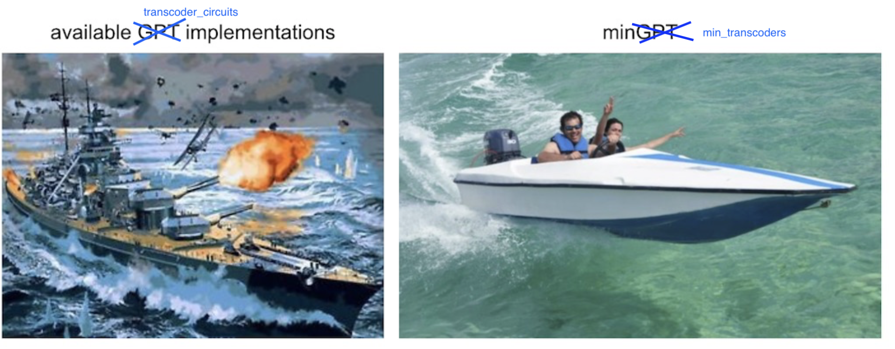

# minTranscoder
Attempting to be a [minGPT](https://github.com/karpathy/minGPT) like implementation for [transcoders](https://github.com/jacobdunefsky/transcoder_circuits) for MLP hidden state in transformers - part of ARENA 4.0 Interpretability Hackathon via Apart Research

## Transcoder Visualization

